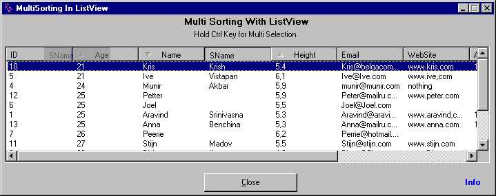



## Multi\-Sorting with ListView

### Description

Multi-Sorting with controls like 'ListView', was always an issue for VB programmers. Here is a dome project of multi-sorting with 'ListView' using 'ActiveX Data Access Object (ADO and ADOR)'.

The Control has designed for single sorting / multi sorting with Characters / Numbers / date type data with ascending/descending order. The order of sorting has been indicated with the icon on the header. User also has possibility to change the arrangements of the fields.

I hope this demo could give you idea to do multi-sorting with list view. Any comments/suggestion always appreciated. Thx.
 
### More Info
 

             |
---                |---
**Submitted On**   |2002-10-04 12:54:02
**By**             |[Deepak Kumar Shaw](https://github.com/Planet-Source-Code/PSCIndex/blob/master/ByAuthor/deepak-kumar-shaw.md)
**Level**          |Advanced
**User Rating**    |5.0 (70 globes from 14 users)
**Compatibility**  |VB 4\.0 \(32\-bit\), VB 5\.0, VB 6\.0
**Category**       |[VB function enhancement](https://github.com/Planet-Source-Code/PSCIndex/blob/master/ByCategory/vb-function-enhancement__1-25.md)
**World**          |[Visual Basic](https://github.com/Planet-Source-Code/PSCIndex/blob/master/ByWorld/visual-basic.md)
**Archive File**   |[Multi\-Sort1404641042002\.zip](https://github.com/Planet-Source-Code/deepak-kumar-shaw-multi-sorting-with-listview__1-39529/archive/master.zip)

